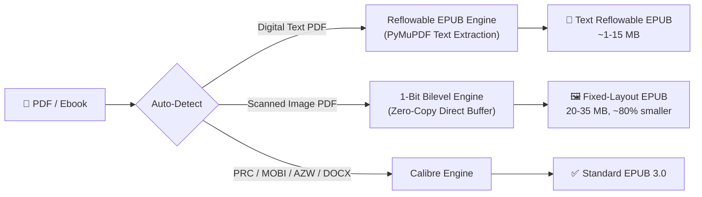
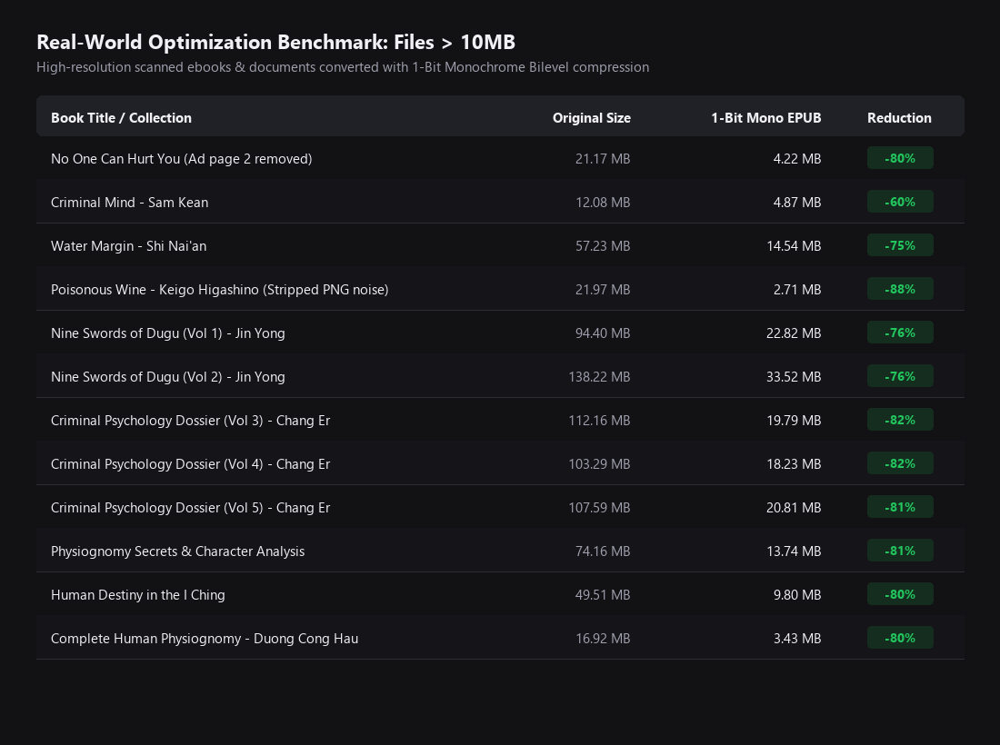

# epub1t 📚⚡

> PDF to EPUB converter optimized for e-readers. Converts scanned PDFs to crisp 1-bit Fixed-Layout EPUBs and digital PDFs to clean Reflowable EPUBs with Vietnamese AVn font decoding.

**English** | [Tiếng Việt](README.vi.md)

[](https://www.python.org/downloads/)
[](https://opensource.org/licenses/MIT)
[](https://github.com/trungtypo-png/epub1t/releases)

---

## 🔄 Processing Pipeline

epub1t auto-detects input type and routes through two dedicated engines:



| Input | Engine | Output |
|-------|--------|--------|
| **PDF with text layer** | PyMuPDF text extraction + AVn decoder | Reflowable EPUB — resizable text, dark mode, live TOC |
| **Scanned PDF / manga** | 1-bit bilevel + auto-polarity | Fixed-Layout EPUB — vector-crisp on E-ink, 80% size cut |
| **PRC, MOBI, AZW, DOCX** | Calibre CLI + cover fixer | Standard EPUB 3.0 with real cover |

---

## 🌟 Key Features

**For scanned PDFs:**
- ⚡ **1-Bit Bilevel Compression** — 300-page book in under 25 seconds, ~80% size reduction
- 🛡️ **Auto-Polarity Guard** — detects and fixes inverted (negative) scans automatically
- 🧹 **Adaptive Binarization** — whitens yellowed paper, removes speckle noise

**For digital PDFs:**
- 🎯 **Auto-Detect Mode** — inspects text layer density, picks the right engine automatically
- 🔡 **AVn / VNI Font Decoder** — fixes broken Vietnamese diacritics (`vaâo → vào`) in pre-2005 PDFs
- 🚫 **Header/Footer/Watermark Stripping** — removes running titles, page numbers, site watermarks
- 🖼️ **Collage & Illustration Grouping** — preserves photo montage pages and groups consecutive images

**For all formats:**
- 🎨 **Real Cover Restoration** — replaces Calibre's generic placeholder with the actual book cover
- 🧹 **Ghost Page Cleaner** — removes blank spacer pages and Calibre pdftohtml artifacts
- 📱 **SVG Viewport** — edge-to-edge scaling on any e-reader screen

---

## 📊 Benchmark

| Book | Before | After | Reduction |
|------|--------|-------|-----------|
| Scanned 300 pages | >100 MB | ~22 MB | **78%** |
| Scanned 765 pages | >200 MB | 25.5 MB | **87%** |
| Digital PDF (AVn) | garbled text | clean EPUB | **<1 MB** |



---

## 📦 Installation

**Option 1 — Standalone app** (no Python needed):
Download from **[Releases](https://github.com/trungtypo-png/epub1t/releases)**: `Epub1t-v1.3.2-Windows.zip` or `Epub1t-v1.3.2-macOS.zip`.

**Option 2 — Run from source:**
```bash
git clone https://github.com/trungtypo-png/epub1t.git
cd epub1t
pip install -r requirements.txt
python gui.py
```

> **Optional:** [Calibre](https://calibre-ebook.com/download) — only needed for PRC / MOBI / AZW3 / DOCX conversion.

---

## 🚀 Usage

**GUI:** Run `python gui.py` or double-click the executable. Select a file or folder, choose mode (or leave on **Auto**), click convert.

**CLI:**
```bash
# Auto-detect (default) — digital text → Reflowable EPUB; scan → 1-bit EPUB
python scripts/convert_books.py "/path/to/books"

# Force specific mode
python scripts/convert_books.py "/path/to/books" --mode 1bit
python scripts/convert_books.py "/path/to/book.pdf" --mode text

# Standalone utilities
python scripts/clean_large_epubs.py "/path/to/books"   # clean ghost pages & artifacts
python scripts/fix_epub_covers.py "/path/to/books"     # restore real book covers
```

---

## 📝 Changelog

### v1.3.2
- 🎯 **Auto-Detect Mode** — automatically routes digital PDFs to Reflowable EPUB and scanned PDFs to 1-Bit engine
- 📖 **Reflowable EPUB** — out of Beta: in-flow typography, real chapter TOC, collage preservation, AVn decoding
- 🖼️ **Collage Auto-Preservation** — photo montage pages rendered as single full-page plate
- 📑 **Hierarchical Chapter TOC** — major chapters vs sub-sections, no false splits
- 🚫 **Running Header/Footer Stripping** — removes watermarks without breaking text

### v1.3.1
- 🛡️ Auto-Polarity Guard for inverted scans
- 📊 Record compression: 765 pages → 25.51 MB (~33 KB/page)

### v1.2.0
- 🚀 4.5x speed boost via zero-copy direct buffer pipeline
- 📊 Real-time per-page progress bar

### v1.1.x
- Native high-res scan extraction, paper whitening & anti-noise filter, full-viewport SVG

---

## 🤝 Credits

- **[Calibre](https://github.com/kovidgoyal/calibre)** by Kovid Goyal
- **[PyMuPDF](https://github.com/pymupdf/PyMuPDF)** by Artifex Software
- **[Pillow](https://github.com/python-pillow/Pillow)** by Jeffrey A. Clark
- **[KCC](https://github.com/ciromattia/kcc)** by Ciro Mattia & Darío Marcelino

---

## 🤖 AI Agent Skill

Includes [`SKILL.md`](./SKILL.md) for use with **Google Antigravity** or other AI agent frameworks.

---

## 📄 License

MIT License. See [LICENSE](LICENSE) for details.
