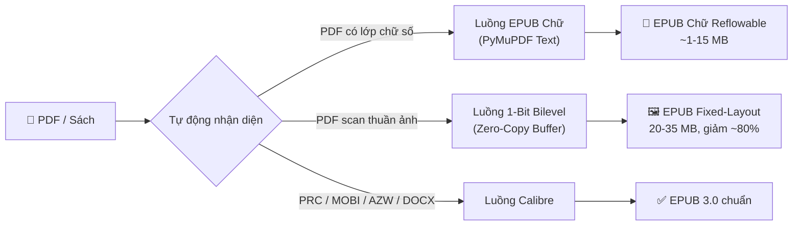

# epub1t 📚⚡

> Công cụ chuyển đổi PDF sang EPUB tối ưu cho máy đọc sách. Chuyển PDF scan thành EPUB Fixed-Layout 1-bit siêu nét và PDF chữ số thành EPUB Chữ Reflowable với giải mã font AVn tiếng Việt.

[English](README.md) | **Tiếng Việt**

[](https://www.python.org/downloads/)
[](https://opensource.org/licenses/MIT)
[](https://github.com/trungtypo-png/epub1t/releases)

---

## 🔄 Luồng Xử Lý

epub1t tự động nhận diện loại tài liệu và điều hướng qua 2 luồng chuyên biệt:



| Đầu vào | Luồng xử lý | Kết quả |
|---------|-------------|---------|
| **PDF có lớp chữ** | Trích xuất text + giải mã AVn | EPUB Chữ — chỉnh cỡ chữ, đọc đêm, mục lục sống |
| **PDF scan / manga** | 1-bit bilevel + khử âm bản | EPUB Fixed-Layout — nét như vector, giảm 80% dung lượng |
| **PRC, MOBI, AZW, DOCX** | Calibre CLI + sửa bìa | EPUB 3.0 chuẩn với bìa thật |

---

## 🌟 Tính Năng Nổi Bật

**Cho PDF scan:**
- ⚡ **Nén 1-Bit Bilevel** — 300 trang dưới 25 giây, giảm ~80% dung lượng
- 🛡️ **Auto-Polarity Guard** — tự động phát hiện và đảo ngược ảnh âm bản
- 🧹 **Adaptive Binarization** — làm trắng nền giấy ố vàng, lọc sạch hạt bụi/noise

**Cho PDF chữ số:**
- 🎯 **Chế độ Tự Động (Auto-Detect)** — phân tích mật độ text, tự chọn đúng luồng xử lý
- 🔡 **Giải mã font AVn / VNI** — sửa lỗi vỡ dấu tiếng Việt (`vaâo → vào`) trong sách PDF cũ trước 2005
- 🚫 **Khử Header / Footer / Watermark** — loại bỏ tiêu đề lặp, số trang, nhãn quảng cáo
- 🖼️ **Bảo toàn trang ảnh ghép (Collage)** — giữ nguyên trang photo montage và gom nhóm ảnh liền kề

**Cho mọi định dạng:**
- 🎨 **Phục hồi bìa thật** — thay bìa placeholder của Calibre bằng bìa minh họa gốc
- 🧹 **Khử trang trắng & layer rác** — dọn sạch trang trống và artifact từ Calibre pdftohtml
- 📱 **SVG Viewport** — tự co giãn vừa khít màn hình mọi máy đọc sách

---

## 📊 Kết Quả Thực Tế

| Sách | Trước | Sau | Giảm |
|------|-------|-----|------|
| Scan 300 trang | >100 MB | ~22 MB | **78%** |
| Scan 765 trang | >200 MB | 25.5 MB | **87%** |
| PDF cổ font AVn | chữ vỡ dấu | EPUB chuẩn | **<1 MB** |


---

## 📦 Cài Đặt

**Cách 1 — App đóng gói sẵn** (không cần Python):
Tải từ **[Releases](https://github.com/trungtypo-png/epub1t/releases)**: `Epub1t-v1.3.2-Windows.zip` hoặc `Epub1t-v1.3.2-macOS.zip`.

**Cách 2 — Chạy từ source:**
```bash
git clone https://github.com/trungtypo-png/epub1t.git
cd epub1t
pip install -r requirements.txt
python gui.py
```

> **Tùy chọn:** [Calibre](https://calibre-ebook.com/download) — chỉ cần khi convert PRC / MOBI / AZW3 / DOCX.

---

## 🚀 Hướng Dẫn Sử Dụng

**GUI:** Chạy `python gui.py` hoặc click đúp file exe. Chọn file/thư mục, để chế độ **Tự động** (hoặc chỉ định thủ công), nhấn chuyển đổi.

**CLI:**
```bash
# Tự động nhận diện (mặc định) — chữ → EPUB Chữ; scan → EPUB 1-Bit
python scripts/convert_books.py "/duong/dan/thu/muc/sach"

# Chỉ định chế độ cụ thể
python scripts/convert_books.py "/duong/dan/sach" --mode 1bit
python scripts/convert_books.py "/duong/dan/sach.pdf" --mode text

# Công cụ độc lập
python scripts/clean_large_epubs.py "/duong/dan"   # dọn trang trắng & layer rác
python scripts/fix_epub_covers.py "/duong/dan"     # phục hồi bìa thật
```

---

## 📝 Nhật Ký Cập Nhật

### v1.3.2
- 🎯 **Chế độ Tự Động (Auto-Detect)** — tự phân loại PDF chữ vs PDF scan, không cần chọn thủ công
- 📖 **EPUB Chữ chính thức** — tốt nghiệp Beta: dàn trang in-flow, mục lục chương sống, bảo toàn collage
- 🖼️ **Bảo toàn trang ảnh ghép** — trang photo montage render thành 1 tấm ảnh nguyên vẹn
- 📑 **Mục lục phân cấp chuẩn** — phân biệt tiêu đề chương lớn và mục con, không bị split sai
- 🚫 **Khử Header/Footer/Watermark** — bóc sạch tiêu đề lặp và nhãn quảng cáo

### v1.3.1
- 🛡️ Auto-Polarity Guard cho ảnh âm bản
- 📊 Kỷ lục nén: 765 trang → 25.51 MB (~33 KB/trang)

### v1.2.0
- 🚀 Tăng tốc 4.5 lần qua zero-copy direct buffer
- 📊 Thanh tiến trình theo thời gian thực

### v1.1.x
- Trích xuất ảnh scan độ phân giải gốc, làm trắng nền & khử noise, SVG full-viewport

---

## 🤝 Ghi Nhận

- **[Calibre](https://github.com/kovidgoyal/calibre)** — Kovid Goyal
- **[PyMuPDF](https://github.com/pymupdf/PyMuPDF)** — Artifex Software
- **[Pillow](https://github.com/python-pillow/Pillow)** — Jeffrey A. Clark
- **[KCC](https://github.com/ciromattia/kcc)** — Ciro Mattia & Darío Marcelino

---

## 🤖 AI Agent Skill

Đi kèm file [`SKILL.md`](./SKILL.md) để nạp vào **Google Antigravity** hoặc các AI agent framework tự động hóa quy trình xử lý kho sách.

---

## 📄 Giấy Phép

[MIT License](LICENSE).
