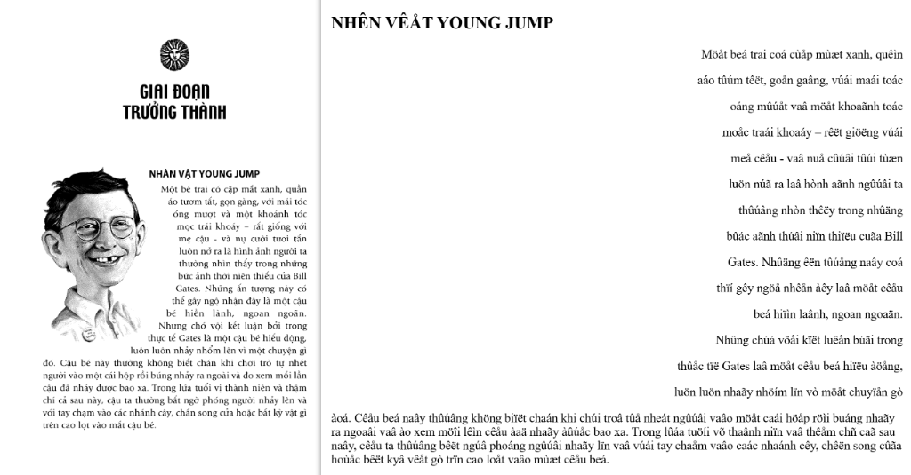

# epub1t 📚⚡

> Công cụ chuyển đổi PDF sang EPUB (PDF to EPUB Converter) và tối ưu hóa sách điện tử chất lượng cao. Chuyển đổi PDF scan, sách số (PRC, MOBI, AZW, AZW3, DOCX) sang EPUB với chuẩn nén 1-bit Monochrome Bilevel siêu nhẹ, nhận diện OCR PyMuPDF, giải mã font cổ AVn tiếng Việt, khử trang trắng rác và phục hồi ảnh bìa minh họa gốc.

[English](README.md) | **Tiếng Việt**

[](https://www.python.org/downloads/)
[](https://opensource.org/licenses/MIT)
[](https://github.com/trungtypo-png/epub1t/releases)

---

## 🌟 Tính Năng Nổi Bật

- ⚡ **Chuẩn Nén 1-Bit Monochrome Bilevel:** Biến các cuốn sách scan chữ dung lượng nặng (>100MB) thành file EPUB Fixed-Layout siêu nhẹ (chỉ còn ~20–35MB) mà vẫn giữ độ sắc nét từng nét chữ ở độ phân giải cao (2000px - 3400px).
- 🚀 **Tốc Độ Xử Lý Siêu Tốc (Direct Buffer):** Stream trực tiếp mảng pixel bộ nhớ không qua encode trung gian, nén cả cuốn sách dày 300 trang chỉ mất **dưới 25 giây** (nhanh hơn gấp 4.5 lần).
- 🛡️ **Bộ Lọc Nhận Diện Cực Tính Tự Động (Auto-Polarity Guard):** Tự động phát hiện các trang scan âm bản hoặc đối tượng PDF `ImageMask` có bảng giải mã nghịch đảo (`/Decode [1 0]`) để đảo cực chuẩn: nền trắng tinh khiết (`255`), chữ đen nhánh (`0`).
- 🧹 **Bộ Lọc Binarization Thông Minh & Khử Noise:** Tự động nhận diện làm trắng tinh nền giấy scan ố vàng/xám, triệt tiêu 100% hạt bụi đen li ti quanh chữ và hình minh họa.
- 🎨 **Tự Động Phục Hồi Bìa Sách Minh Họa Gốc:** Tự động trích xuất ảnh bìa chất lượng cao từ trang đầu tiên của file gốc và thay thế bìa tạm 2 màu mặc định của Calibre.
- 🧹 **Khử Sạch Layer Rác & Trang Trắng Đệm:** Sử dụng thuật toán phân tích histogram độ lệch chuẩn (`mean >= 250`, `stddev <= 3.5`) để loại bỏ 100% trang trắng rác, đồng thời bóc tách sạch các layer phân mảnh `_2.jpg`, `_3.png` và icon `<3KB` do Calibre `pdftohtml` sinh ra.
- 🔡 **Giải Mã Font Chữ Cổ AVn / VNI-Times:** Tự động sửa lỗi vỡ dấu tiếng Việt nghiêm trọng (`vaâo → vào`, `khoaû → khỏa`) trong các sách PDF xuất bản trước năm 2005 — xuất ra EPUB Unicode UTF-8 chuẩn dưới 1MB.
- 📱 **Khung Hiển Thị Responsive SVG Viewport:** Sử dụng thẻ `<svg viewBox="0 0 w h">` giúp trang sách tự động phóng to vừa vặn 100% cửa sổ đọc trên mọi loại thiết bị (Kindle, Kobo, iPad, điện thoại, máy tính) mà không bị viền đen hay lệch khung hình.
- 🛡️ **Bảo Toàn Dữ Liệu An Toàn:** Tự động kiểm tra tính toàn vẹn của file EPUB (`META-INF/container.xml`) trước khi quyết định xóa file nguồn cũ.

---

## 📊 Kết Quả Benchmark Thực Tế

### 1. Chuẩn Nén 1-Bit Monochrome Bilevel (Sách PDF Scan)
> Các file sách scan PDF >10MB được nén sang EPUB 1-Bit Monochrome:


Mức giảm dung lượng trung bình đạt: **~80%** trên toàn bộ 12 bộ sách scan thử nghiệm thực tế — chữ nét đanh, không mờ nhòe.

### 2. Giải Mã Font Chữ Cổ AVn / VNI-Times (PDF Tiếng Việt Trước 2005)
> Xử lý triệt để lỗi vỡ dấu tiếng Việt nghiêm trọng (`vaâo → vào`, `khoaû → khỏa`, `thûuâng → thường`):



* **Trước khi giải mã (Bên phải):** Chữ bị phân mảnh thành các ký tự rác PostScript do font AVn 1-byte/2-byte cũ không tương thích Unicode.
* **Sau khi giải mã (Bên trái):** Xuất bản thành file EPUB reflowable chuẩn Unicode UTF-8 đọc mượt mà, chữ đẹp chuẩn in, dung lượng dưới 1MB.

---

## 📝 Nhật Ký Cập Nhật (Changelog)

### v1.1.3
* 🎯 **Nhận Diện Độ Nét Gốc Native High-Res:** Tự động trích xuất ảnh scan gốc độ nét cao (`2332 x 3444` chuẩn benchmark bộ sách LEGO) mà không bị hạ độ phân giải.
* 📱 **Khung SVG Full-Viewport Edge-to-Edge:** Loại bỏ các thẻ wrapper trung gian, khớp 100% toàn màn hình trên máy đọc sách (Kindle, Kobo, iPad).
* 🧹 **Bộ Lọc Làm Trắng Nền & Khử Noise:** Triệt tiêu hoàn toàn các hạt bụi đen (noise) lấm tấm quanh viền chữ và tranh.

### v1.2.0
* 🚀 **Tăng Tốc 4.5 Lần (Direct Buffer):** Truyền trực tiếp dữ liệu pixel từ bộ nhớ C của MuPDF vào Pillow qua `Image.frombytes()` và tối ưu hóa nén PNG tức thì (nén cả cuốn sách dày 300 trang chỉ mất ~23 giây).
* 📊 **Tiến Độ Thời Gian Thực:** Bổ sung thanh tiến trình và nhãn phần trăm chi tiết (`Trang X/Tổng (Y%)`) trực quan trên giao diện GUI.

### v1.3.0 (Beta)
* 📖 **Trích Xuất Text & Xuất EPUB Chữ Số (Reflowable):** Bổ sung tính năng trích xuất toàn bộ sách sang file `.txt` Unicode sạch và đóng gói thành sách điện tử EPUB chữ số chuẩn dạng cuộn mượt (Reflowable) kèm ảnh bìa gốc.
* ⚡ **Bộ Giải Mã AVn/VNI Siêu Tốc (Regex Single-Pass):** Tự động phát hiện và giải mã các font chữ cổ tiếng Việt (AVn, VNI, BK HCM) chỉ trong **0.4 giây** cho toàn bộ 288 trang sách.
* 👁️ **Hỗ Trợ Tích Hợp PyMuPDF OCR:** Tự động fallback sang công nghệ nhận diện quang học OCR nếu trang PDF là bản scan thuần ảnh không có lớp chữ số.
* 🎛️ **Chế Độ Thứ 4 Trên GUI:** Thêm lựa chọn `EPUB Chữ (Beta)` ngay trên giao diện ứng dụng.

### v1.3.1
* 🛡️ **Bộ Lọc Tự Động Nhận Diện Cực Tính (Auto-Polarity Guard):** Tự động phát hiện các trang scan âm bản hoặc PDF `ImageMask` có bảng giải mã nghịch đảo (`/Decode [1 0]`, độ sáng trung bình `< 128`) để đảo cực chuẩn xác.
* 📄 **Nền Trắng Tinh Khiết & Chữ Đen Nhánh:** Toàn bộ các trang sách ruột (ngay cả các bộ sách dày >700 trang) luôn hiển thị nền trắng `255`, nét chữ và tranh vẽ đen nhánh `0`, loại bỏ 100% tình trạng âm bản (nền đen xì, chữ trắng lóa) và khử sạch hạt bụi/noise xám mốc.
* 📱 **Khung Hiển Thị Full-Bleed SVG Viewport:** Giữ nguyên bìa gốc, trang ruột full-bleed SVG viewport tự co giãn vừa khít màn hình mọi app đọc sách.
* 📊 **Dung Lượng Siêu Nhẹ:** Toàn bộ 765 trang siêu nét (`2122 x 3000px`) được nén gọn chỉ còn **25.51 MB** (~33 KB/trang).

---

## 📦 Cài Đặt & Sử Dụng

### 1. Tải Ứng Dụng Đóng Gói Sẵn (Không Cần Cài Python)
Tải trực tiếp từ mục **[Releases](https://github.com/trungtypo-png/epub1t/releases)**:
* **Windows:** Tải file `Epub1t-v1.3.1-Windows.zip` (giải nén và chạy `Epub1t.exe`).
* **macOS:** Tải file `Epub1t-v1.3.1-macOS.zip` (giải nén và mở app).

### 2. Hoặc Chạy Trực Tiếp Bằng Python 3.9+
```bash
git clone https://github.com/trungtypo-png/epub1t.git
cd epub1t
pip install -r requirements.txt
python gui.py
```

### 3. Công cụ Calibre (Tùy chọn cho sách chữ)
* Chỉ cần khi chuyển đổi sách chữ định dạng cổ (`.prc`, `.mobi`, `.azw3`, `.docx`).
* Tải về tại [Trang chủ Calibre](https://calibre-ebook.com/download) (hoặc bản Calibre Portable).

---

## 🚀 Hướng Dẫn Sử Dụng

### 1. Giao Diện Đồ Họa (GUI)
Chạy `python gui.py` hoặc click đúp file `.exe` / app đã đóng gói.

### 2. Dòng Lệnh (CLI)
```bash
# Chuyển đổi toàn bộ thư mục sách/PDF (Chế độ 1-bit scan)
python scripts/convert_books.py "/duong/dan/thu/muc/sach" --mode 1bit

# Trích xuất toàn bộ text sạch và xuất EPUB chữ số dạng cuộn mượt
python scripts/convert_books.py "/duong/dan/sach.pdf" --mode text

# Chuyển đổi và xóa an toàn file gốc
python scripts/convert_books.py "/duong/dan/thu/muc/sach" --delete-source

# Dọn sạch trang trắng & layer rác
python scripts/clean_large_epubs.py "/duong/dan/thu/muc/sach"

# Sửa bìa minh họa gốc
python scripts/fix_epub_covers.py "/duong/dan/thu/muc/sach"
```

---

## 💡 Các Trường Hợp Sử Dụng Điển Hình (Use Cases & Solutions)

Nếu bạn đang tìm kiếm giải pháp tối ưu cho kho sách điện tử của mình, **epub1t** giải quyết trọn vẹn các bài toán thường gặp:

* 📚 **Chuyển đổi PDF sang EPUB cho máy đọc sách (Kindle, Kobo, Boox, iPad):**
  Các file PDF scan thường có dung lượng rất nặng (>100MB), gây giật lag hoặc tràn RAM trên máy đọc sách. Epub1t tối ưu hóa và chuyển đổi sách PDF scan sang EPUB Fixed-Layout với chuẩn nén 1-bit Monochrome Bilevel, giảm đến 80% dung lượng (chỉ còn ~20–35MB) mà từng nét chữ và biểu đồ vẫn sắc nét như in ở độ phân giải cao.

* 📖 **Trích xuất Text & OCR PDF tiếng Việt sang EPUB Chữ Số (Reflowable):**
  Chuyển đổi tài liệu scan ảnh hoặc file PDF số sang sách điện tử dạng cuộn chữ mượt mà. Tích hợp engine PyMuPDF OCR tiếng Việt tự động quét ảnh thành văn bản, cho phép bạn tùy chỉnh kích thước font chữ, đổi nền sáng/tối và tra từ điển dễ dàng.

* 🔡 **Khắc phục lỗi font chữ cổ tiếng Việt (AVn / VNI / TCVN3 / BK HCM):**
  Sửa triệt để tình trạng vỡ dấu tiếng Việt nghiêm trọng (`vaâo → vào`, `thûuâng → thường`) khi convert các file PDF sách cũ xuất bản trước năm 2005 sang Unicode UTF-8 chuẩn chỉ trong **0.4 giây** cho toàn bộ cuốn sách.

* 🔄 **Chuyển đổi định dạng sách chữ hàng loạt (PRC, MOBI, AZW, AZW3, DOCX sang EPUB):**
  Tự động quét và chuẩn hóa toàn bộ thư viện sách chữ về định dạng chuẩn EPUB 3 chất lượng cao, đồng thời tự động xóa an toàn file nguồn cũ sau khi đã xác thực file EPUB hoàn chỉnh.

* 🎨 **Phục hồi bìa sách minh họa gốc & Khử trang trắng rác:**
  Khắc phục hoàn toàn tình trạng Calibre tự vẽ bìa tạm 2 màu làm mất ảnh bìa thật của sách. Tự động bóc tách bìa chất lượng cao từ trang đầu và khử sạch 100% trang trắng đệm hay layer rác phát sinh.

---

## 🤝 Lời Cảm Ơn & Ghi Nhận Đóng Góp (Credits & Contributors)

Dự án xin gửi lời cảm ơn trân trọng đến các tác giả và cộng đồng các dự án mã nguồn mở tuyệt vời:

* **[Calibre](https://github.com/kovidgoyal/calibre)** phát triển bởi *Kovid Goyal* và các cộng tác viên — Công cụ tiêu chuẩn hàng đầu thế giới về quản lý và chuyển đổi ebook.
* **[Kindle Comic Converter (KCC)](https://github.com/ciromattia/kcc)** phát triển bởi *Ciro Mattia*, *Darío Marcelino* và cộng đồng — Nền tảng tiên phong tối ưu truyện tranh cho thiết bị đọc sách e-reader.
* **[PyMuPDF (FitZ)](https://github.com/pymupdf/PyMuPDF)** phát triển bởi *Artifex Software* & đội ngũ *PyMuPDF* — Engine trích xuất và render PDF tốc độ cao.
* **[Pillow (PIL)](https://github.com/python-pillow/Pillow)** bởi *Jeffrey A. Clark* và cộng tác viên — Thư viện xử lý hình ảnh cốt lõi trong Python.

---

## 🤖 Antigravity / AI Agent Skill

Repository này đi kèm file cấu hình [`SKILL.md`](./SKILL.md) đã được chuẩn hóa sẵn, có thể nạp trực tiếp vào **Google Antigravity** hoặc các framework AI Agent để tự động hóa toàn bộ quy trình xử lý kho sách của bạn.

---

## 📄 Giấy Phép (License)

Phát hành dưới giấy phép mã nguồn mở [MIT License](LICENSE).
