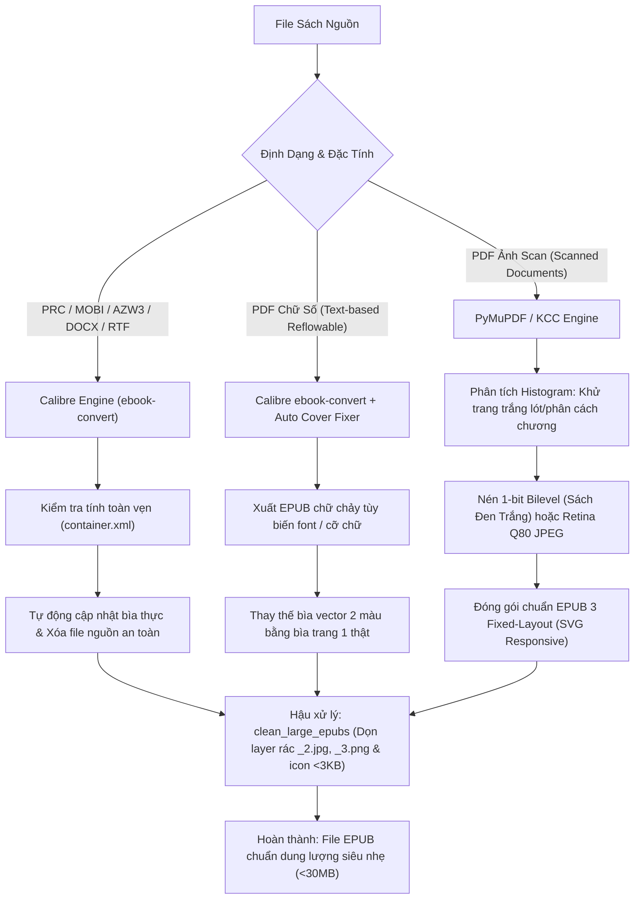

# Ebook Pipeline: Chuyển Đổi Sách, Khử Trang Trắng & Tối Ưu Hóa EPUB Chuẩn Quốc Tế

Pipeline chuyên sâu tự động hóa toàn bộ quy trình **chuyển đổi, dọn dẹp layer rác, loại bỏ trang trắng đệm, phục hồi ảnh bìa gốc thực tế và nén tối ưu dung lượng** cho mọi định dạng sách số và tài liệu scan sang `.epub` (EPUB 3 / Reflowable & Fixed-Layout).

---

## 1. Yêu Cầu Phần Mềm & Cài Đặt (Prerequisites)

Để pipeline hoạt động đầy đủ tính năng, cần chuẩn bị các công cụ sau:

### 1.1. Calibre (Ebook Converter Engine)
Dùng để chuyển đổi các định dạng văn bản (PRC, MOBI, AZW3, DOCX, EPUB...) và trích xuất cấu trúc reflowable.
* **Download:** [Calibre Official Website](https://calibre-ebook.com/download) (hoặc bản Calibre Portable).
* **Cấu hình PATH:** Đảm bảo `ebook-convert` có trong biến môi trường `PATH`, hoặc đặt biến môi trường `CALIBRE_PATH`:
  * *Windows:* `C:\Program Files\Calibre2\ebook-convert.exe` hoặc `D:\Calibre Portable\Calibre\ebook-convert.exe`
  * *macOS:* `/Applications/calibre.app/Contents/MacOS/ebook-convert`
  * *Linux:* `/usr/bin/ebook-convert`

### 1.2. Kindle Comic Converter - KCC (Tùy chọn cho Sách tranh / Manga / Fixed-Layout)
* **Download:** [GitHub - ciromattia/kcc](https://github.com/ciromattia/kcc/releases)
* Hỗ trợ chuẩn hóa ảnh scan, chia đôi trang đôi (spread splitting) và tối ưu độ phân giải cho thiết bị e-reader.

### 1.3. Môi trường Python & Thư viện phụ trợ
Yêu cầu **Python 3.9+**. Cài đặt các thư viện xử lý ảnh và PDF:

```bash
pip install -r requirements.txt
```

Hoặc cài trực tiếp:
```bash
pip install pymupdf Pillow
```

* `pymupdf` (FitZ): Render trang PDF vector/scan siêu tốc độ cao, trích xuất ảnh bìa chất lượng cao.
* `Pillow` (PIL): Phân tích histogram, tính độ lệch chuẩn (stddev) để phát hiện trang trắng rác và chuyển đổi nén 1-bit Monochrome.

---

## 2. Quy Trình Phân Loại & Xử Lý (Pipeline Architecture)



---

## 3. Các Tiêu Chuẩn Kỹ Thuật Cốt Lõi

### 3.1. Phục hồi ảnh bìa minh họa chính thức (Official Illustrated Cover)
* **Vấn đề:** Khi convert từ PDF/MOBI, Calibre thường tự sinh một file ảnh bìa 2 màu khối generic (`cover_image.jpg`), vô tình đẩy ảnh bìa minh họa thực tế vào trang 2 hoặc làm mất bìa trên trình đọc.
* **Xử lý:** Script `fix_epub_covers.py` tự động quét trang đầu tiên của file gốc hoặc các file ảnh nội bộ (`index-1_1.jpg`, `cover.jpg`) để trích xuất bìa gốc sắc nét và ghi đè vào metadata `cover_image.jpg`.

### 3.2. Khử trang trắng rác & Layer phân mảnh (Blank & Multi-layer Artifact Cleanup)
* **Vấn đề Calibre pdftohtml:** Chuyển đổi PDF có layer/vector thường tạo ra 3 ảnh/trang (`_1.jpg` nền, `_2.jpg` icon, `_3.png` overlay trong suốt) sinh ra hàng trăm trang trắng đệm xen kẽ và tăng gấp 5–10 lần dung lượng.
* **Vấn đề Trang trắng scan:** Bản scan tài liệu thường có các trang trắng phân cách chương hoặc trang giấy lót.
* **Giải pháp:** Phân tích độ lệch chuẩn & độ sáng trên dải xám (`mean >= 250` & `stddev <= 3.5` hoặc trang đen `mean <= 5` & `stddev <= 2`) để loại bỏ 100% trang trắng rác, đồng thời bóc tách sạch các thẻ `` và manifest trong `content.opf`.

### 3.3. Khung hiển thị Responsive SVG Viewport (Fixed-Layout)
Với sách scan, áp dụng chuẩn SVG Responsive Viewport cho toàn bộ các trang:
```html
<svg width="100%" height="100%" viewBox="0 0 {width} {height}">
    <image width="{width}" height="{height}" href="../Images/page_0001.jpg"/>
</svg>
```
Đảm bảo trang sách tự động co giãn vừa vặn 100% khung hình trên mọi thiết bị e-reader/tablet mà không bị viền đen thừa hay lệch tỉ lệ.

### 3.4. Chuẩn Nén 1-bit High-Res Monochrome cho PDF Scan Chữ
* Đối với sách scan chữ và sơ đồ đen trắng, không lưu dạng JPEG 24-bit (dung lượng thường > 100MB).
* **Quy chuẩn:**
  1. **Bìa (Trang 1):** Giữ nguyên màu RGB chất lượng cao (JPEG Q85 hoặc WebP).
  2. **Trang ruột:** Chuyển đổi sang **1-bit Monochrome Bilevel PNG** (`im.convert('1')`) ở độ phân giải gốc cao nhất (2000px – 3400px).
  3. **Hiệu quả:** Mỗi trang chỉ tốn **30–70 KB**, cuốn sách 400 trang chỉ còn **~20–35 MB**, nét đanh từng nét chữ và lật trang siêu mượt.

---

## 4. Hướng Dẫn Sử Dụng (Usage)

### 4.1. Chuyển đổi tài liệu & PDF Scan qua CLI:
```bash
# Chuyển đổi toàn bộ tài liệu trong thư mục sang EPUB (1-bit monochrome cho PDF scan)
python scripts/convert_books.py "/path/to/ebooks" --mode 1bit

# Chuyển đổi và xóa file nguồn gốc nếu EPUB tạo thành công
python scripts/convert_books.py "/path/to/ebooks" --delete-source
```

### 4.2. Quét & Dọn sạch Layer rác / Trang trắng toàn thư viện:
```bash
python scripts/clean_large_epubs.py "/path/to/ebooks"
```

### 4.3. Sửa bìa minh họa cho toàn bộ EPUB:
```bash
python scripts/fix_epub_covers.py "/path/to/ebooks"
```

---

## 5. Nguyên Tắc An Toàn Dữ Liệu
1. **Bảo toàn file gốc:** Luôn kiểm tra tính toàn vẹn của EPUB đích (`META-INF/container.xml` và dung lượng > 1KB) trước khi xóa file nguồn cũ.
2. **Không ghi đè mù quáng:** Giữ nguyên các file `.epub` phát hành chính hãng (Retail EPUB) nếu chúng đã đạt chuẩn kỹ thuật.
