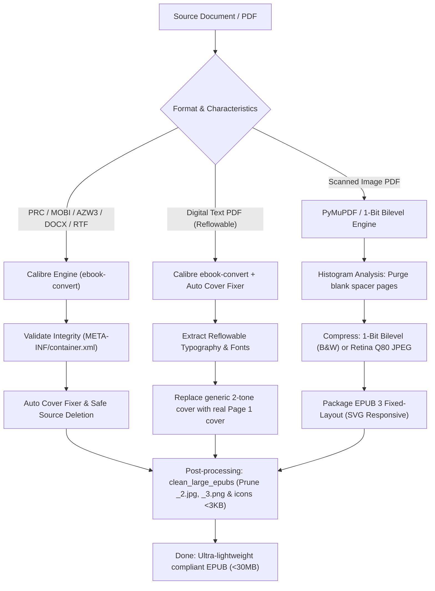

# Ebook Pipeline: Document Conversion, Blank Page Cleaning & EPUB Optimization

This skill specifies the comprehensive automation workflow and technical standards for **converting, de-duplicating ghost layers, removing blank spacer pages, restoring official illustrated covers, and compressing** text documents and scanned PDFs into standard `.epub` files.

---

## 1. Prerequisites & Software Installation

### 1.1. Calibre CLI (Reflowable & Digital Document Engine)
Required when converting legacy reflowable text documents (`.prc`, `.mobi`, `.azw`, `.azw3`, `.docx`, `.doc`, `.fb2`).
* **Download:** [Calibre Official Website](https://calibre-ebook.com/download) (or Calibre Portable).
* **PATH Configuration:** Ensure `ebook-convert` is in your system `PATH` or set the `CALIBRE_PATH` environment variable:
  * *Windows:* `C:\Program Files\Calibre2\ebook-convert.exe` or `D:\Calibre Portable\Calibre\ebook-convert.exe`
  * *macOS:* `/Applications/calibre.app/Contents/MacOS/ebook-convert`
  * *Linux:* `/usr/bin/ebook-convert`

### 1.2. Kindle Comic Converter - KCC (Optional for Manga / Comics)
* **Download:** [GitHub - ciromattia/kcc](https://github.com/ciromattia/kcc/releases)
* Used for spread splitting and panel optimization on e-reader devices.

### 1.3. Python Environment & Dependencies
Requires **Python 3.9+**. Install the core image & PDF processing libraries:

```bash
pip install -r requirements.txt
```
* `pymupdf` (FitZ): Ultra-fast PDF page rasterization and metadata/cover extraction.
* `Pillow` (PIL): Histogram standard deviation analysis for blank page detection and 1-bit monochrome bilevel conversion.

---

## 2. Pipeline Architecture & Classification



---

## 3. Core Technical Standards

### 3.1. Official Illustrated Cover Restoration
* **Problem:** When converting from PDF or MOBI, Calibre often creates a generic 2-tone SVG/JPEG cover (`cover_image.jpg`), pushing the real illustrated book cover into page 2.
* **Resolution:** `fix_epub_covers.py` automatically inspects page 0 of the source file or internal image manifests (`index-1_1.jpg`, `cover.jpg`) to extract the authentic high-resolution cover and overwrite `cover_image.jpg`.

### 3.2. Ghost Blank Page & Multi-layer Artifact Cleanup
* **Calibre pdftohtml Artifacts:** Converting PDFs with complex layering splits each page into 3 fragmented files (`_1.jpg` base, `_2.jpg` icons, `_3.png` transparent overlay), creating hundreds of ghost blank pages and bloating file sizes by 500–1000%.
* **Scanned Spacer Pages:** Older book scans often contain blank separator sheets and endpapers.
* **Resolution:** Using grayscale histogram standard deviation thresholding (`mean >= 250` & `stddev <= 3.5` for white; `mean <= 5` & `stddev <= 2` for black), the pipeline discards 100% of blank pages and unlinks orphaned `` tags from XHTML and OPF manifests.

### 3.3. Responsive SVG Viewport for Fixed-Layout EPUBs
Every scanned page is rendered inside a responsive SVG container:
```html
<svg width="100%" height="100%" viewBox="0 0 {width} {height}">
    <image width="{width}" height="{height}" href="../Images/page_0001.png"/>
</svg>
```
Ensures 100% edge-to-edge scaling across all screen sizes and e-reader form factors without distortion or letterboxing.

### 3.4. 1-Bit High-Resolution Monochrome Bilevel Compression
* For black-and-white scanned books, 24-bit RGB JPEG encoding causes massive file bloat (>100MB) and compression blur.
* **Standard:**
  1. **Cover (Page 1):** Preserves native RGB full color (JPEG Q85+ or WebP).
  2. **Interior Pages:** Converted directly to **1-bit Monochrome Bilevel PNG** (`im.convert('1', dither=FLOYDSTEINBERG)`) at native resolution (2000px–3400px).
  3. **Result:** Each page requires only **30–60 KB**, reducing a 400-page book to **~20–35 MB** with vector-sharp text readability.

### 3.5. Legacy Vietnamese Font Decoding (AVn / VNI-Times / Composite PostScript)
* **Problem:** Vietnamese PDF books published before 2005 (e.g., First News, NXB Trẻ) commonly use 1-byte/2-byte proprietary font encodings (`AVnTechno`, `AVnGiovanni`). Standard text extraction tools produce severely broken diacritics such as `vaâo chuaáng voà khaã nùng àuåt cûuåc` — rendering the extracted text completely unreadable.
* **Resolution:** A composite diacritic token analyzer maps base vowels (`a`, `ù`, `ê`, `ï`, `ö`, `ú`, `û`, `à`) and tone marks (`á`, `â`, `ã`, `ä`, `å`) to produce accurate **Unicode UTF-8** output, ensuring clean readable EPUBs well under 1MB.

---

## 4. Execution Commands & Automation

### 4.1. Batch Document & Scan Conversion
```bash
# Convert a folder with 1-bit scan optimization
python scripts/convert_books.py "/path/to/books" --mode 1bit

# Convert and safely delete source files upon success
python scripts/convert_books.py "/path/to/books" --delete-source
```

### 4.2. Clean Multi-layer Artifacts & Blank Pages
```bash
python scripts/clean_large_epubs.py "/path/to/books"
```

### 4.3. Restore Official Illustrated Covers
```bash
python scripts/fix_epub_covers.py "/path/to/books"
```

---

## 5. Data Safety & Integrity Rules

1. **Retail Preservation:** Never overwrite verified official retail `.epub` files.
2. **Safe Source Deletion:** Source files are only removed after the output EPUB passes structural validation (`META-INF/container.xml` present and file size > 1KB).

---

## ⚖️ DISCLAIMER / MIỄN TRỪ TRÁCH NHIỆM

### ENGLISH
This is an independent, non-commercial open-source project created by its author for personal and educational use. It is provided free of charge, **"AS IS"** and **"AS AVAILABLE"**, without any warranty or promise of support, maintenance, updates, compatibility, security, reliability, or fitness for a particular purpose.

Using this software is completely voluntary and at your own risk. The process may fail, erase or corrupt data, or cause malfunctions. Before proceeding with batch conversions or source deletion options, ensure you have backed up your original files. You are solely responsible for data backups, file integrity, and the consequences of using this tool.

The author and contributors disclaim all responsibility for loss or damage arising from downloading, installing, modifying, or using this software, including data loss, loss of use, or consequential damages.

### TIẾNG VIỆT
Đây là dự án mã nguồn mở độc lập, phi thương mại, được phát triển cho mục đích sử dụng cá nhân và nghiên cứu học tập. Bộ công cụ được cung cấp hoàn toàn miễn phí theo nguyên tắc **"NGUYÊN TRẠNG" (AS IS)** và **"HIỆN CÓ" (AS AVAILABLE)**, không đi kèm bất kỳ bảo hành hay cam kết nào về việc hỗ trợ, bảo trì, cập nhật, tính tương thích, độ tin cậy hay sự phù hợp cho một mục đích cụ thể.

Việc cài đặt và sử dụng phần mềm là hoàn toàn tự nguyện và thuộc về trách nhiệm của chính bạn. Quá trình chuyển đổi có thể gặp lỗi hoặc làm thay đổi dữ liệu nếu chọn tính năng tự động xóa file nguồn. Hãy luôn sao lưu dữ liệu gốc của bạn trước khi thực hiện các tác vụ hàng loạt. Bạn hoàn toàn chịu trách nhiệm về dữ liệu, sao lưu và các hệ quả phát sinh từ việc sử dụng công cụ này.

Tác giả và các cộng tác viên từ chối mọi trách nhiệm đối với bất kỳ mất mát hay thiệt hại nào phát sinh từ việc tải về, cài đặt, chỉnh sửa hoặc sử dụng công cụ, bao gồm cả mất mát dữ liệu hoặc các thiệt hại gián tiếp.
